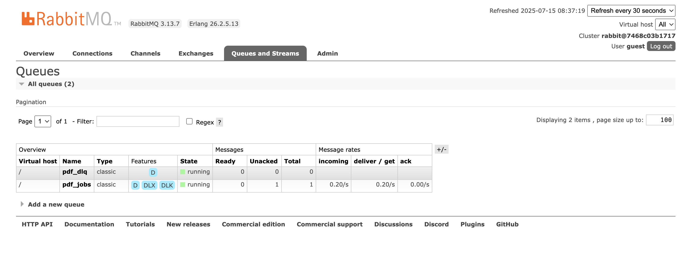
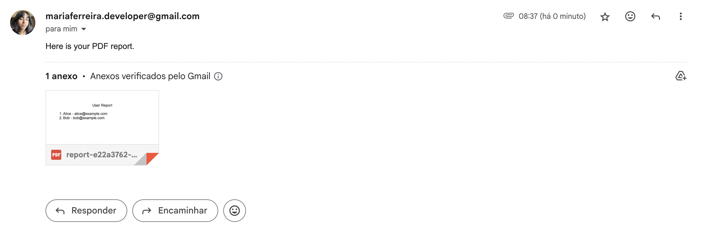

# 📨 PDF Generation & Emailing System with Node.js, RabbitMQ, and Docker

This project provides a scalable and robust system for generating dynamic PDF reports and sending them via email. It uses a microservices architecture with a REST API, a message queue for background processing, and a worker to handle the PDF generation and emailing.

## Table of Contents

- [Features](#features)
- [Architecture Overview](#architecture-overview)
- [Getting Started](#getting-started)
  - [Prerequisites](#prerequisites)
  - [Configuration](#configuration)
  - [Running the System](#running-the-system)
- [Services](#services)
- [API Usage](#api-usage)
  - [Postman](#postman)
  - [Example Request](#example-request)
  - [cURL Example](#curl-example)
- [Dead Letter Queue (DLQ)](#-dead-letter-queue-dlq)
- [Screenshots](#screenshots)

## Features

- **REST API**: Accepts PDF generation requests.
- **Background Processing**: Uses RabbitMQ to queue jobs for asynchronous processing.
- **Dead Letter Queue (DLQ)**: Automatically handles failed jobs for later inspection or reprocessing.
- **Dynamic PDF Generation**: Creates PDFs from JSON data using `pdfkit`.
- **Email Delivery**: Sends generated PDFs as attachments using `nodemailer`.
- **Containerized**: Fully containerized with Docker and Docker Compose for easy setup and deployment.

## Architecture Overview

1.  The **API** (`/api`) receives a POST request to `/generate`.
2.  It publishes a message containing the request data to a **RabbitMQ** queue (`pdf_tasks`).
3.  The **Worker** (`/worker`) consumes messages from the queue.
4.  For each message, the worker generates a PDF and sends it via email.
5.  If the email fails to send, the message is routed to a Dead Letter Queue (`pdf_dlq`) for manual review.

## Getting Started

### Prerequisites

- [Docker](https://www.docker.com/get-started)
- [Docker Compose](https://docs.docker.com/compose/install/)
- [Git](https://git-scm.com/downloads/)

### 1. Clone the Repository

```bash
git clone https://github.com/marinspira/pdf-email-rabbitmq.git
cd pdf-email-rabbitmq
```

### 2. Configuration

Edit the email credentials in `worker/worker.js`. For production, it is highly recommended to use environment variables.

For Gmail, you will need to generate an [App Password](https://myaccount.google.com/u/1/apppasswords).

### 3. Running the System

```bash
docker-compose up --build
```

This command will build the Docker images and start all the services.

## Services

Once running, the following services will be available:

- **📮 RabbitMQ Server**: `localhost:5672`
- **📊 RabbitMQ Management UI**: `http://localhost:15672` (user: `guest` / pass: `guest`)
- **🌐 REST API**: `http://localhost:3000`

## API Usage

Send a `POST` request to the `/generate` endpoint with a JSON payload containing the recipient's email and the data for the PDF.

### Postman

You can test the API by importing the request from this Postman link:
[https://postman.co/workspace/My-Workspace~a074a07f-6201-42e6-8a95-6b1061e3f0ed/request/21395016-3a885250-6eb6-4c99-af57-4f82edfb720c](https://postman.co/workspace/My-Workspace~a074a07f-6201-42e6-8a95-6b1061e3f0ed/request/21395016-3a885250-6eb6-4c99-af57-4f82edfb720c)

### Example Request

**Endpoint**: `POST /generate`

**Body**:
```json
{
  "email": "recipient@example.com",
  "users": [
    { "name": "Alice", "email": "alice@example.com" },
    { "name": "Bob", "email": "bob@example.com" }
  ]
}
```

### cURL Example

```bash
curl -X POST http://localhost:3000/generate \
  -H "Content-Type: application/json" \
  -d '{ "email": "recipient@example.com", "users": [ { "name": "Alice", "email": "alice@example.com" }, { "name": "Bob", "email": "bob@example.com" } ] }'
```

## 🪦 Dead Letter Queue (DLQ)

If a job fails (e.g., due to an email sending error), the message is automatically routed to the `pdf_dlq` queue. You can view these failed messages in the RabbitMQ Management UI to diagnose issues, reprocess them, or log them for analysis.

## Screenshots

### RabbitMQ Management UI
*Shows the queues, including the main task queue and the dead-letter queue.*


### Sample Email
*An example of the email with the generated PDF attached.*
